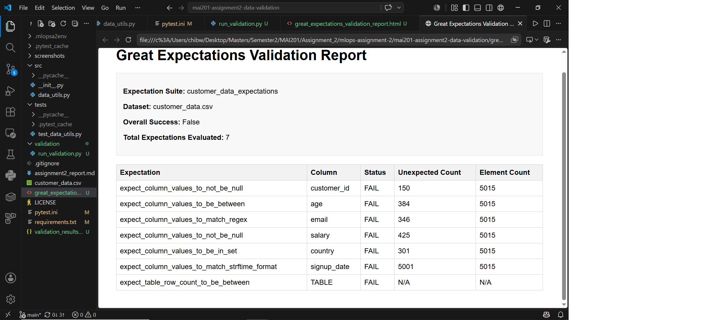
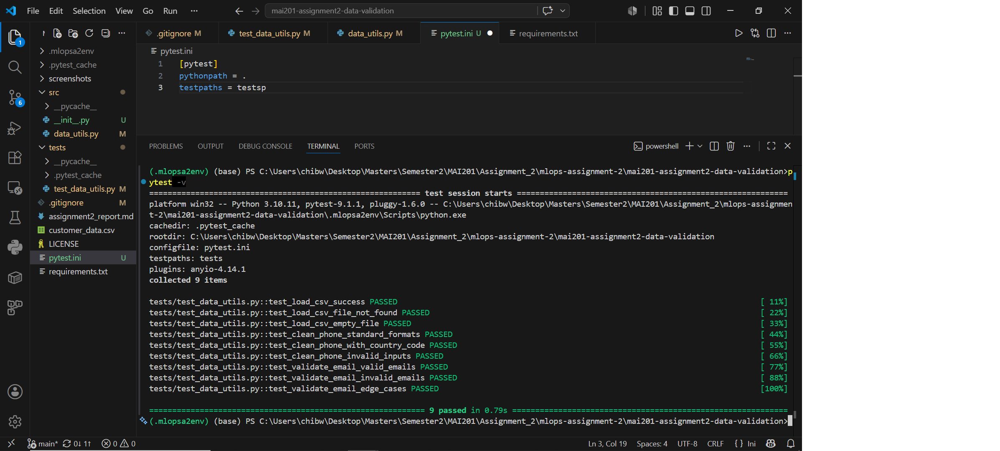

# MAI201 MLOps Assignment 2 Report

## Student Information

Name: Chipemba Bwacha  
Course: MAI201 MLOps  
Assignment: Assignment 2 - Data Validation & Testing  

---

## Repository URL

https://github.com/Chipemba/mai201-assignment2-data-validation.git
---

## 1. Great Expectations Validation Results

The screenshot below shows the Great Expectations validation results for the `customer_data.csv` dataset using the expectation suite `customer_data_expectations`.

---

## 2. Data Quality Issues Found

## 1. Great Expectations Validation Results

The screenshot below shows the Great Expectations validation results for the `customer_data.csv` dataset using the expectation suite `customer_data_expectations`.

The validation result shows that the dataset did not pass the expectation suite. The overall validation status was `False`, meaning one or more expectations failed. A total of 7 expectations were evaluated against 5,015 rows.

| Expectation | Column | Status | Unexpected Count | Element Count |
|---|---|---:|---:|---:|
| Values must not be null | `customer_id` | FAIL | 150 | 5,015 |
| Values must be between 0 and 120 | `age` | FAIL | 384 | 5,015 |
| Values must match valid email regex | `email` | FAIL | 346 | 5,015 |
| Values must not be null | `salary` | FAIL | 425 | 5,015 |
| Values must be in allowed country set | `country` | FAIL | 301 | 5,015 |
| Values must match signup date format | `signup_date` | FAIL | 5,001 | 5,015 |
| Table row count must be between 500 and 1000 | Table | FAIL | N/A | N/A |

The validation results show several major data quality problems. The `customer_id` column contains 150 missing values, which is a serious issue because this column is expected to uniquely identify each customer. The `age` column contains 384 values outside the valid range of 0 to 120. The `email` column contains 346 invalid email formats. The `salary` column contains 425 missing values, which violates the expectation that salary should be present in at least 95% of rows. The `country` column contains 301 values outside the allowed set of USA, Canada, UK, and Australia.

The most significant validation failure is in the `signup_date` column, where 5,001 out of 5,015 rows failed the expected date format check. This suggests that the date format in the dataset may not match the `%Y-%m-%d` format used in the expectation, or that the column contains inconsistent or invalid date values.

The table row count expectation also failed because the dataset contains 5,015 rows, while the expected range was between 500 and 1000 rows.

---

## 3. pytest Execution Results

The screenshot below shows the pytest execution results. All tests passed successfully.

---

## 4. Reflection

The data quality issue that would most impact ML model performance is the salary column problem. Salary is likely to be an important predictive feature in a customer dataset because it may relate to customer behavior, eligibility, purchasing power, or churn risk. If salary values are missing, negative, or stored inconsistently as strings with dollar signs, the model may learn incorrect patterns or fail during preprocessing.

Out-of-range ages and invalid emails are also important, but salary problems can directly affect numerical feature engineering and model training. For example, a negative salary is not realistic and could distort averages, scaling, and learned relationships. Therefore, salary should be cleaned by removing dollar signs, converting the column to a numeric type, handling missing values carefully, and validating that all salary values are positive before the dataset is used in an ML pipeline.

---

## 5. Summary

This assignment demonstrated how data validation and testing support MLOps workflows. Great Expectations was used to define and run validation rules for the customer dataset, while pytest was used to test utility functions for loading CSV files, cleaning phone numbers, and validating email addresses. These practices help catch data quality issues early and make data pipelines more reliable and reproducible.